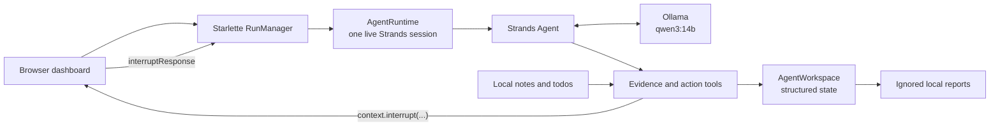

# Loose Ends Agent

Loose Ends Agent is a local-first personal obligation reconciler built with the
[Strands Agents SDK](https://strandsagents.com/) for the AWS Agents for Humans
Hackathon. It scans notes, todo exports, and documents, connects evidence that
describes the same unfinished obligation, and turns safe cases into concrete
next actions. When evidence conflicts or intent is ambiguous, it pauses the
actual agent run for a human decision.

The project does not send messages, purchase anything, edit source documents,
or silently choose between conflicting commitments.

## The Problem

Personal obligations rarely live in one clean task list. A deadline may appear
in a note, supporting details may live in a todo export, and another document
may contradict the date. Traditional task managers preserve each record but do
not reconcile what those records mean together.

That leaves people with the real work: finding duplicates, noticing conflicts,
deciding what is safe, and remembering which source justified the result.

## The Solution

Loose Ends Agent treats each source record as evidence. A real Strands
`Agent` decides what to inspect, which tools to call, whether records describe
the same obligation, whether a next action is sufficiently grounded, and when
human judgment is required.

Every decision remains tied to source path, line number, original text, and
detected date. Human escalation is a first-class workflow state implemented
with a genuine Strands interrupt, not a text label.

## What The Agent Does

1. Lists available local source files.
2. Scans relevant notes, todo exports, and documents.
3. Extracts unfinished obligations while preserving provenance.
4. Resolves explicit and relative deadline candidates.
5. Finds potentially related evidence without automatically merging it.
6. Creates evidence-backed loose ends.
7. Produces a grounded ready action when acting is safe.
8. Calls `request_human_decision` when evidence conflicts or intent is unresolved.
9. Resumes the same Strands session after the browser submits a choice.
10. Writes a structured local action log after reconciliation completes.

## Strands Architecture

Strands is the orchestration brain. The model controls the live loop:

```text
observe -> reason -> tool call -> observe result -> decide -> act or escalate
```

The production tool surface is:

- `list_sources`
- `scan_notes`
- `scan_tasks`
- `inspect_documents`
- `find_deadlines`
- `find_related_items`
- `create_loose_end`
- `mark_ready_action`
- `request_human_decision`
- `write_action_log`

Deterministic Python utilities perform parsing, extraction, date handling,
similarity suggestions, provenance validation, and action grounding. They do
not script the agent's tool order or replace the Strands decision loop.



The standalone Mermaid source is available in
[`docs/architecture.mmd`](docs/architecture.mmd).

## Provenance And Human-in-the-Loop

Each evidence record includes:

- stable evidence ID
- source path and source type
- source line number
- original evidence text
- supported due date
- extraction confidence

Tool contracts reject unknown evidence IDs, unsupported dates, unrelated
merges, and actions that introduce people, plans, entities, or relationships
not present in the assigned evidence.

When `request_human_decision` is accepted, it calls the Strands tool context's
`interrupt(...)` method. The web run becomes **Paused - human decision
required** and is explicitly incomplete. The UI displays the question,
choices, and conflicting provenance. Submitting a choice sends a Strands
`interruptResponse` to the same in-memory Agent instance. Historical JSON
reports are read-only and are never presented as resumable after restart.

## Requirements

- Python 3.10 or newer
- [Ollama](https://ollama.com/)
- approximately 10 GB of free disk space for `qwen3:14b`
- enough system or GPU memory to run the selected Ollama model comfortably

The validated default is the tool-capable `qwen3:14b` model. Ollama
preflight checks the model metadata and refuses inference when tool capability
is absent.

## Setup

Windows PowerShell:

```powershell
git clone https://github.com/haleeozz/loose-ends-agent.git
cd loose-ends-agent

py -3.12 -m venv .venv
.\.venv\Scripts\Activate.ps1
python -m pip install --upgrade pip
python -m pip install -e ".[dev,local-model]"

ollama pull qwen3:14b
```

Verify the SDK, model metadata, and tool construction without invoking the
model:

```powershell
loose-ends --check-sdk --as-of 2026-09-12
```

## Run The Web Demo

Start Ollama, then launch the local dashboard:

```powershell
loose-ends-web
```

Open [http://127.0.0.1:8000](http://127.0.0.1:8000), then:

1. Click **Start new run**.
2. Watch the real agent call `list_sources`, `scan_notes`, and `scan_tasks`.
3. Wait for **Paused - human decision required**.
4. Inspect both passport records and their conflicting dates.
5. Select `2026-09-30`.
6. Click **Submit decision and resume**.
7. Observe `Invocation 2 - 1 resumes`, the grounded ready action, and the
   natural `end_turn` completion.

Only one model invocation runs at a time. The checked-in demo corpus is
intentionally narrow so the recording path exercises the complete production
workflow without unrelated obligations:

- `data/notes/weekend_notes.md`: passport deadline `2026-10-01`
- `data/todos/personal.json`: passport deadline `2026-09-30`

The verified result is a ready action to renew the passport with the compliant
photo and old passport, using the human-selected `2026-09-30` deadline.

## CLI And Verification

Run the agent with high-level tool tracing:

```powershell
loose-ends --demo --provider ollama --model qwen3:14b --as-of 2026-09-12
```

Run the focused real-model interrupt verification:

```powershell
.\.venv\Scripts\python.exe scripts\verify_hitl_agent.py
```

Run the deterministic fallback:

```powershell
loose-ends --mode fallback --as-of 2026-09-12 --show-all
```

Run the test suite:

```powershell
.\.venv\Scripts\python.exe -m pytest
```

The current suite contains 25 tests covering extraction, provenance,
grounding, merge safety, first-class interrupts, same-session web resume,
historical report safety, and idempotency contracts.

## Supported Inputs

- Markdown and plain-text notes
- JSON todo exports containing a list, `todos`, or `tasks`
- task text fields named `task`, `title`, `text`, or `name`
- optional `due`, `status`, and `context` fields

Completed or cancelled items are ignored.

## Limitations

- The demo is local-only and currently uses Ollama; there is no hosted deployment.
- Live interrupt/resume state is in memory and is lost when the server restarts.
- The default `qwen3:14b` model has meaningful local hardware requirements.
- Model-selected tool order and wording remain nondeterministic, although tool
  contracts enforce deterministic provenance and safety boundaries.
- The recording fixture intentionally demonstrates one conflicting passport
  obligation. Larger mixed-obligation corpora can expose model convergence
  edge cases and are not the submission demo path.
- No external action execution, email integration, authentication, or
  production persistence is included yet.

## Optional Amazon Bedrock Provider

The CLI also supports Bedrock:

```powershell
$env:AWS_PROFILE = "your-profile"
$env:AWS_REGION = "us-east-1"
loose-ends --demo --provider bedrock --model global.anthropic.claude-sonnet-4-6 --as-of 2026-09-12
```

This requires a valid AWS credential source, enabled model access, and
`bedrock:InvokeModel` / `bedrock:InvokeModelWithResponseStream`
permissions. AWS is not required for the local Ollama demo.

## License

Released under the [MIT License](LICENSE).
